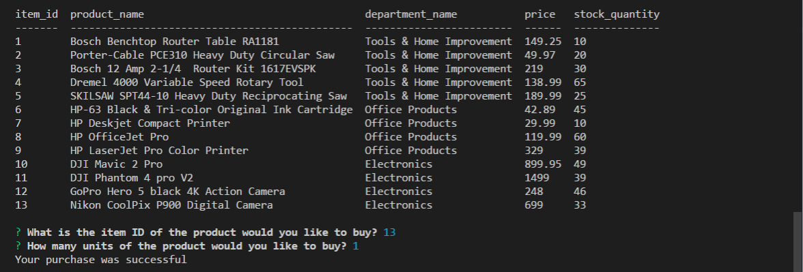
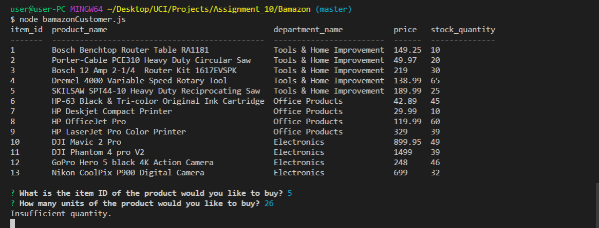

# Bamazon
Running this app will display all the items available for sale including IDs's, names, and prices of products for sale. The app should then prompt users with two messages. 1) item ID of product customer would like to buy. 2) number of units customer would like to buy. Once the customer has placed the order, the app checks if store has enough quantity to meet customer request. If not, the app will log "Insufficient quantity!, and then prevent order from going through. However if there is enough quantity of the bought product, the customer's order is fulfilled.

<!-- Format:  -->